# 🧬 ATACFlow: 完整的ATAC-seq数据分析流程

ATACFlow是一个全面的ATAC-seq数据分析流程，涵盖了从原始数据质控到最终报告生成的完整分析过程。该流程针对植物基因组特性进行了优化，能够有效处理细胞器污染等问题。

## 📋 流程概览

ATACFlow包含以下主要分析阶段：

1. **数据预处理与质控**
2. **序列比对与过滤**
3. **Peak识别与注释**
4. **合并样本分析**
5. **转录因子结合位点分析**
6. **质量控制与报告生成**

```mermaid
%% 初始化配置：使用 base 主题，强制让背景透明，线条用中性色 %%
%%{
  init: {
    'theme': 'base',
    'themeVariables': {
      'primaryColor': '#E3F2FD',
      'primaryTextColor': '#2c3e50',
      'lineColor': '#7f8c8d',
      'fontFamily': 'Helvetica'
    }
  }
}%%

graph LR

    %% -------------------- 样式库 -------------------- %%
    %% 核心技巧：颜色不要太深，也不要太亮，保持中间调 %%

    %% 普通节点：圆角 + 中性边框 %%
    classDef base fill:#fff,stroke:#7f8c8d,stroke-width:1px,rx:5,ry:5,color:#333;

    %% 1. 数据流 (蓝色系) - 在黑夜模式下会显得很亮眼 %%
    classDef raw fill:#e3f2fd,stroke:#1565c0,stroke-width:2px,rx:5,ry:5,color:#0d47a1;

    %% 2. 比对流 (绿色系) %%
    classDef map fill:#e8f5e9,stroke:#2e7d32,stroke-width:2px,rx:5,ry:5,color:#1b5e20;

    %% 3. 分析流 (橙色系) %%
    classDef core fill:#fff3e0,stroke:#ef6c00,stroke-width:2px,rx:5,ry:5,color:#e65100;

    %% 4. 高级流 (紫色系) %%
    classDef adv fill:#f3e5f5,stroke:#7b1fa2,stroke-width:2px,rx:5,ry:5,color:#4a148c;

    %% 5. 终点 (深灰底白字) - 注意：fill 用深灰而不是纯黑，stroke 用浅灰，这样在黑底也能看清边界 %%
    classDef endNode fill:#37474f,stroke:#cfd8dc,stroke-width:2px,rx:15,ry:15,color:#fff;


    %% -------------------- 流程图内容 -------------------- %%

    %% 1. 数据清洗 %%
    subgraph S1 ["Step 1: Data Cleaning"]
        direction TB
        Raw[Raw Data]:::raw --> MD5{MD5 Check}:::base
        MD5 --> QC1[FastQC & Screen]:::base
        QC1 --> Trim[Fastp Trimming]:::base
        Trim --> Clean[Clean Data]:::raw
    end

    %% 2. 比对与过滤 %%
    subgraph S2 ["Step 2: Mapping & Filtering"]
        direction TB
        Clean --> Bowtie2[Bowtie2 Mapping]:::map
        Bowtie2 --> Filter[Structural Filtering]:::base
        Filter --> Shift[Fragment Shifting]:::base
        Shift --> BAM[Processed BAM]:::map
    end

    %% 3. Peak识别 %%
    subgraph S3 ["Step 3: Peak Calling"]
        direction TB
        BAM --> MACS2[MACS2 Peak Calling]:::core
        MACS2 --> Peaks[Individual Peaks]:::core
        Peaks --> MergePeaks[Merge Group Peaks]:::core
        MergePeaks --> Consensus[Consensus Peaks]:::core
    end

    %% 4. 高级分析 %%
    subgraph S4 ["Step 4: Advanced Analysis"]
        direction TB
        BAM -.-> ATACv[ATACv QC]:::adv
        MergePeaks -.-> TOBIAS[TOBIAS Motifs]:::adv
        Consensus -.-> DEG[DESeq2 Analysis]:::adv
        DEG --> Enrich["GO/KEGG Enrichment"]:::adv
    end

    %% 5. 交付 %%
    Report(Final Report):::endNode

    %% -------------------- 连线逻辑 -------------------- %%
    ATACv --> Report
    TOBIAS --> Report
    Enrich --> Report

    %% -------------------- 关键美化：透明化 Subgraph -------------------- %%
    %% 这一步把那块黑色的背景去掉了！ %%
    %% fill:none = 透明 %%
    %% stroke:#7f8c8d = 中性灰边框 (黑白背景都可见) %%
    %% stroke-dasharray = 虚线，看起来更轻盈 %%

    style S1 fill:none,stroke:#7f8c8d,stroke-width:2px,stroke-dasharray: 5 5,color:#7f8c8d
    style S2 fill:none,stroke:#7f8c8d,stroke-width:2px,stroke-dasharray: 5 5,color:#7f8c8d
    style S3 fill:none,stroke:#7f8c8d,stroke-width:2px,stroke-dasharray: 5 5,color:#7f8c8d
    style S4 fill:none,stroke:#7f8c8d,stroke-width:2px,stroke-dasharray: 5 5,color:#7f8c8d

    %% 统一线条颜色为中性灰 %%
    linkStyle default stroke:#7f8c8d,stroke-width:1px,fill:none;
```



## 🔬 详细分析流程

### 1. 数据预处理与质控 (Quality Control & Preprocessing)

#### 目标
对原始测序数据进行质量控制和预处理，确保后续分析的数据质量。

#### 工具
- FastQC: 序列质量评估
- Fastp: 序列修剪和过滤
- MultiQC: 质控结果汇总
- FastQ Screen: 污染检测

#### 处理步骤
- **MD5校验**: 验证原始数据完整性
- **FastQC分析**: 评估原始数据质量
- **污染检测**: 使用FastQ Screen检测外源序列污染
- **序列修剪**: 使用Fastp去除低质量序列和接头
- **质控汇总**: 使用MultiQC生成综合质控报告

### 2. 序列比对与过滤 (Mapping & Filtering)

#### 目标
将高质量的reads比对到参考基因组，并进行严格的过滤以获得高质量的比对结果。

#### 工具
- Bowtie2: 序列比对
- Samtools: BAM文件处理
- 自研Rust工具: 结构性过滤

#### 处理步骤
- **序列比对**: 使用Bowtie2将reads比对到参考基因组
- **重复标记**: 使用GATK标记PCR重复
- **基础过滤**: 去除未比对、次要比对和低质量比对
- **植物学优化**: 动态剔除线粒体和叶绿体比对reads
- **结构性过滤**: 使用自研工具进行配对关系严格质控
- **坐标排序**: 生成最终的坐标排序BAM文件

### 3. Peak识别与注释 (Peak Calling & Annotation)

#### 目标
识别开放染色质区域并进行功能注释。

#### 工具
- MACS2: Peak识别
- HOMER: Peak注释

#### 处理步骤
- **Peak识别**: 使用MACS2识别开放染色质区域
- **Peak注释**: 使用HOMER对peaks进行基因功能注释
- **TSS富集分析**: 评估ATAC-seq数据质量

### 4. 合并样本分析 (Merged Sample Analysis)

#### 目标
对同一组的生物学重复样本进行合并分析，提高检测效力。

#### 处理步骤
- **BAM文件合并**: 合并同一组的生物学重复样本
- **合并Peak识别**: 在合并样本上进行peak识别
- **Peak注释**: 对合并样本的peaks进行注释

### 5. 转录因子结合位点分析 (Motif Analysis)

#### 目标
识别开放染色质区域中的转录因子结合位点，并比较不同实验组间的差异。

#### 工具
- TOBIAS (Transcription factor Occupancy prediction By Investigation of ATAC-seq Signal)

#### 分析流程
- **足迹分析 (Footprinting)**: 识别蛋白质-DNA结合足迹，推断转录因子结合位点
- **结合偏好分析 (BINDetect)**: 基于motif数据库检测转录因子结合偏好
- **组间差异分析**: 比较预定义对比组间的转录因子结合差异
- **可视化**: 生成火山图、MA图等可视化结果

#### 输出文件
- 格式化的peak文件
- 校正后的信号bigwig文件
- 足迹分析结果
- 转录因子结合检测结果和可视化图表
- 组间差异分析报告

### 6. 质量控制与报告生成 (QC & Reporting)

#### 目标
生成全面的质量控制报告和分析结果报告。

#### 工具
- ataqv: ATAC-seq特异性质控
- MultiQC: 结果汇总
- 自定义报告工具

#### 处理步骤
- **ataqv质控**: 生成ATAC-seq特异性质量控制报告
- **结果汇总**: 使用MultiQC汇总所有分析结果
- **数据交付**: 组织和打包所有分析结果
- **报告生成**: 生成最终分析报告

## 📁 输出目录结构

```
├── 00.raw_data/           # 原始数据链接和MD5校验
├── 01.qc/                 # 质控结果
│   ├── short_read_qc_r1/  # R1 reads质控
│   ├── short_read_qc_r2/  # R2 reads质控
│   ├── short_read_trim/   # 修剪后数据和质控报告
│   └── ...
├── 02.mapping/            # 比对结果
│   ├── Bowtie2/           # Bowtie2比对结果
│   ├── filter_pe/         # 过滤后结果
│   ├── shifted/           # 位移后结果
│   └── merged/            # 合并样本结果
├── 03.peak_calling/       # Peak识别结果
│   ├── MACS2/             # 单样本peak calling
│   ├── MERGE_MACS2/       # 合并样本peak calling
│   ├── HOMER/             # 单样本peak注释
│   └── MERGE_HOMER/       # 合并样本peak注释
├── 04.consensus/          # 共识peak集
├── 05.qc/                 # ATAC-seq特异性质控
├── 06.motif_analysis/     # 转录因子结合位点分析
│   ├── 01.formatted_peaks/
│   ├── 02.signal_corrected/
│   ├── 03.footprints/
│   ├── 04.bindetect/
│   ├── 05.differential_motifs/
│   └── 06.final_report/
└── report/                # 最终报告
```

## ⚙️ 配置文件

流程使用多个配置文件来控制分析参数：

- `config.yaml`: 基本配置参数
- `reference.yaml`: 参考基因组路径配置
- `run_parameter.yaml`: 软件运行参数
- `cluster_config.yaml`: 集群资源配置

## 🧠 流程设计哲学

ATACFlow遵循以下设计理念：

1. **模块化设计**: 每个分析步骤都是独立的模块，便于维护和扩展
2. **质量优先**: 严格的质控和过滤步骤确保分析结果的可靠性
3. **植物学优化**: 针对植物基因组特点进行特殊优化处理
4. **自动化交付**: 自动生成完整的分析报告和交付清单
5. **可重现性**: 使用Snakemake确保分析流程的可重现性

## 🚀 使用方法

```bash
# 运行完整分析流程
snakemake --cores=60 -p --conda-frontend mamba --use-conda --rerun-triggers mtime  --logger rich-loguru --config analysisyaml=/data/jzhang/project/Temp/atac_human_PRJNA427322/01.workflow/config.yaml
```