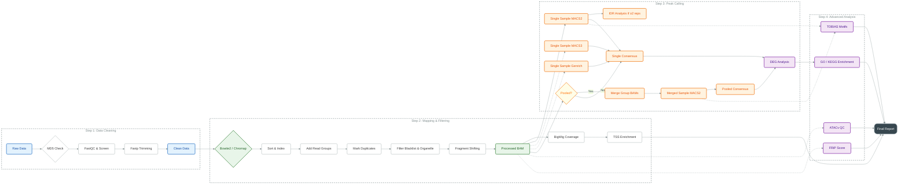

# 🧬 ATACFlow: Complete ATAC-seq Data Analysis Pipeline

**Version**: v0.0.5

[中文版本](./docs/README_CN.md)

ATACFlow is a comprehensive ATAC-seq data analysis pipeline that covers the complete analysis process from raw data quality control to final report generation. The pipeline is optimized for plant genome characteristics and can effectively handle issues such as organelle contamination.

## 📜 Version Changelog

### v0.0.5 (2024-03)
- **New**: Flexible Peak Calling strategy configuration (`peak_calling.use_pooled_peaks`)
- **Optimized**: Reorganized output directory structure of peak calling module, clearly separating single sample, pooled, and IDR analysis
- **Optimized**: Integrated FRiP (Fraction of Reads in Peaks) quality control into the pipeline
- **Fixed**: Fixed bug where DEG analysis could not run in single sample group cases
- **Improved**: Added automatic fallback logic, automatically using single sample consensus peaks when pooled peaks cannot be used
- **New**: Multi-engine Peak Calling support — added **Genrich** and **MACS3 BED-shift** as alternative peak callers alongside MACS2
- **New**: Configurable Bowtie2 alignment parameters (`mode`, `no_mixed`, `no_discordant`, `max_alignments`) for plant genomes in `run_parameter.yaml`
- **New**: Configurable BAM filtering parameters (`flag_filter`, `flag_req`, `mapq`) in `run_parameter.yaml`
- **New**: Added `macs3.yaml` and `genrich.yaml` Conda environments
- **New**: Added **GRCm39** (Mouse) reference genome support in `reference.yaml`
- **Improved**: Dynamic organelle exclusion for `bamCoverage` normalization via `get_organelle_names()`

## 🌟 Core Highlights

ATACFlow is more than just a basic alignment and Peak Calling pipeline; it integrates multiple cutting-edge features:

*   **Dual-engine alignment support**: Supports both **Bowtie2** and **Chromap** alignment engines, which can be flexibly switched via configuration files. **Uses Chromap by default** (optimized for large-scale ATAC-seq data, faster processing); Bowtie2 provides broader compatibility and fine-grained control. Bowtie2 parameters (`--local`/`--end-to-end`, `--no-mixed`, `--no-discordant`) are now fully configurable for plant genomes.
*   **Multi-engine Peak Calling**: Supports **MACS2** (default BAMPE mode), **MACS3** (legacy BED-shift mode with `--shift -75 --extsize 150`), and **Genrich** as alternative peak callers. The BED-shift mode is especially optimized for plant genomes where BAMPE may be too stringent.
*   **Advanced footprint analysis (TOBIAS Footprinting)**: Integrates complete TOBIAS workflow (ATACorrect -> EstimateFootprints -> BINDetect), enabling inference of transcription factor dynamic binding at single-base resolution.
*   **AI-driven automated reporting**: Uses LLM-driven AI engine combined with containerization technology (Apptainer/Docker) to automatically generate interactive analysis reports with biological interpretation.
*   **Deep botanical optimization**: Implements dynamic removal and structural filtering algorithms for the high proportion of mitochondrial/chloroplast contamination in plant genomes, maximizing retention of valid reads.
*   **Flexible Peak Calling strategy** *(v0.0.5)*: Defaults to "Group Merge -> Call Peak" strategy, significantly improving detection sensitivity of weak signal peaks in biological replicate samples. Supports configurable selection of pooled or single sample consensus peaks.

## 📋 Pipeline Overview

ATACFlow includes the following main analysis stages:

1. **Data preprocessing and quality control**
2. **Sequence alignment and filtering**
3. **Peak identification and annotation**
4. **Merged sample analysis**
5. **Transcription factor binding site analysis**
6. **Quality control and report generation**


```mermaid
%% Initial configuration: Use base theme, force transparent background, use neutral colors for lines %%
%%{
  init: {
    'theme': 'base',
    'themeVariables': {
      'primaryColor': '#E3F2FD',
      'primaryTextColor': '#2c3e50',
      'lineColor': '#7f8c8d',
      'fontFamily': 'Helvetica'
    }
  }
}%%

graph LR

    %% -------------------- Style Library -------------------- %%
    %% Core tip: Use mid-tones—not too dark, not too bright %%

    %% Standard node: Rounded corners + neutral border %%
    classDef base fill:#fff,stroke:#7f8c8d,stroke-width:1px,rx:5,ry:5,color:#333;

    %% 1. Data Flow (Blue) - Stands out in Dark Mode %%
    classDef raw fill:#e3f2fd,stroke:#1565c0,stroke-width:2px,rx:5,ry:5,color:#0d47a1;

    %% 2. Alignment Flow (Green) %%
    classDef map fill:#e8f5e9,stroke:#2e7d32,stroke-width:2px,rx:5,ry:5,color:#1b5e20;

    %% 3. Core Analysis Flow (Orange) %%
    classDef core fill:#fff3e0,stroke:#ef6c00,stroke-width:2px,rx:5,ry:5,color:#e65100;

    %% 4. Advanced Flow (Purple) %%
    classDef adv fill:#f3e5f5,stroke:#7b1fa2,stroke-width:2px,rx:5,ry:5,color:#4a148c;

    %% 5. Terminal Node (Dark Grey background, white text) %%
    classDef endNode fill:#37474f,stroke:#cfd8dc,stroke-width:2px,rx:15,ry:15,color:#fff;

    %% Decision Node %%
    classDef decision fill:#fffde7,stroke:#f57f17,stroke-width:2px,rx:5,ry:5,color:#ff6f00;


    %% -------------------- Flowchart Content -------------------- %%

    %% 1. Data Cleaning %%
    subgraph S1 ["Step 1: Data Cleaning"]
        direction TB
        Raw[Raw Data]:::raw --> MD5{MD5 Check}:::base
        MD5 --> QC1[FastQC & Screen]:::base
        QC1 --> Trim[Fastp Trimming]:::base
        Trim --> Clean[Clean Data]:::raw
    end

    %% 2. Mapping & Filtering %%
    subgraph S2 ["Step 2: Mapping & Filtering"]
        direction TB
        Clean --> Align{Bowtie2 / Chromap}:::map
        Align --> Sort[Sort & Index]:::base
        Sort --> AddRG[Add Read Groups]:::base
        AddRG --> MarkDup[Mark Duplicates]:::base
        MarkDup --> FilterBAM[Filter Blacklist & Organelle]:::base
        FilterBAM --> Shift[Fragment Shifting]:::base
        Shift --> BAM[Processed BAM]:::map
        BAM --> BigWig[BigWig Coverage]:::base
        BigWig --> TSS[TSS Enrichment]:::base
    end

    %% 3. Peak Identification - Three Paths %%
    subgraph S3 ["Step 3: Peak Calling"]
        direction TB
        BAM --> SingleMACS2[Single Sample MACS2]:::core
        BAM -.-> SingleMACS3[Single Sample MACS3]:::core
        BAM -.-> SingleGenrich[Single Sample Genrich]:::core
        SingleMACS2 --> IDR[IDR Analysis if ≥2 reps]:::core
        SingleMACS2 --> SingleCon[Single Consensus]:::core
        SingleMACS3 --> SingleCon
        SingleGenrich --> SingleCon

        BAM --> PoolCheck{Pooled?}:::decision
        PoolCheck -->|Yes| MergeBAM[Merge Group BAMs]:::core
        MergeBAM --> MergeMACS2[Merged Sample MACS2]:::core
        MergeMACS2 --> PoolCon[Pooled Consensus]:::core
        PoolCheck -->|No| SingleCon

        SingleCon --> DEG[DEG Analysis]:::adv
        PoolCon --> DEG
    end

    %% 4. Advanced Analysis %%
    subgraph S4 ["Step 4: Advanced Analysis"]
        direction TB
        BAM -.-> ATACv[ATACv QC]:::adv
        BAM -.-> FRiP[FRiP Score]:::adv
        SingleMACS2 -.-> TOBIAS[TOBIAS Motifs]:::adv
        MergeMACS2 -.-> TOBIAS
        DEG --> Enrich[GO / KEGG Enrichment]:::adv
    end

    %% 5. Delivery %%
    Report(Final Report):::endNode

    %% -------------------- Connection Logic -------------------- %%
    ATACv --> Report
    FRiP --> Report
    TSS --> Report
    TOBIAS --> Report
    Enrich --> Report

    %% -------------------- Subgraph Styling: Transparency -------------------- %%
    %% fill:none = Transparent %%
    %% stroke:#7f8c8d = Neutral grey border %%
    %% stroke-dasharray = Dashed line %%

    style S1 fill:none,stroke:#7f8c8d,stroke-width:2px,stroke-dasharray: 5 5,color:#7f8c8d
    style S2 fill:none,stroke:#7f8c8d,stroke-width:2px,stroke-dasharray: 5 5,color:#7f8c8d
    style S3 fill:none,stroke:#7f8c8d,stroke-width:2px,stroke-dasharray: 5 5,color:#7f8c8d
    style S4 fill:none,stroke:#7f8c8d,stroke-width:2px,stroke-dasharray: 5 5,color:#7f8c8d

    %% Unify line colors to neutral grey %%
    linkStyle default stroke:#7f8c8d,stroke-width:1px,fill:none;
```

## 🔬 Detailed Analysis Pipeline

### 1. Quality Control & Preprocessing

#### Objectives
Perform quality control and preprocessing on raw sequencing data to ensure data quality for downstream analysis.

#### Tools
- FastQC: Sequence quality assessment
- Fastp: Sequence trimming and filtering
- MultiQC: Quality control results aggregation
- FastQ Screen: Contamination detection

#### Processing Steps
- **MD5 Verification**: Validate raw data integrity.
- **FastQC Analysis**: Evaluate raw data quality.
- **Contamination Detection**: Use FastQ Screen to detect foreign sequence contamination.
- **Sequence Trimming**: Use Fastp to remove low-quality sequences and adapters.
- **QC Aggregation**: Generate a comprehensive QC report using MultiQC.

### 2. Mapping & Filtering

#### Objectives
Align high-quality reads to the reference genome and perform rigorous filtering to obtain high-quality alignment results.

#### Tools
- **Bowtie2** or **Chromap**: Sequence alignment (configurable).
  - Bowtie2: Classic tool with excellent compatibility and fine-grained parameter control.
  - Chromap: Optimized for large-scale ATAC-seq data with faster processing speeds.
- Samtools: BAM file processing.
- In-house Rust Tools: Structural filtering.

#### Processing Steps
- **Sequence Alignment**: Align reads to the reference genome using Bowtie2 or Chromap.
- **Duplicate Marking**: Mark PCR duplicates using GATK.
- **Basic Filtering**: Remove unmapped, secondary, and low-quality alignments.
- **Botanical Optimization**: Dynamically exclude reads aligned to mitochondrial and chloroplast genomes.
- **Structural Filtering**: Use in-house tools for rigorous paired-end relationship quality control.
- **Coordinate Sorting**: Generate the final coordinate-sorted BAM files.

### 3. Peak Calling & Annotation

#### Objectives
Identify open chromatin regions and perform functional annotation.

#### Tools
- **MACS2**: Peak identification (default, BAMPE mode with Tn5 shift).
- **MACS3**: Legacy peak calling (BED mode with `--shift -75 --extsize 150`), recommended for plant genomes.
- **Genrich**: Alternative peak caller optimized for ATAC-seq/ChIP-seq.
- **HOMER**: Peak annotation.

#### Processing Steps
- **Peak Identification**: Identify open chromatin regions using MACS2.
- **Peak Annotation**: Annotate peak functions using HOMER.
- **TSS Enrichment Analysis**: Evaluate ATAC-seq data quality based on Transcription Start Site enrichment.

### 4. Merged Sample Analysis

#### Objectives
Perform pooled analysis on biological replicates within the same group to increase detection power.

#### Processing Steps
- **BAM Merging**: Merge BAM files from biological replicates of the same group.
- **Pooled Peak Calling**: Identify peaks on the merged samples.
- **Peak Annotation**: Annotate peaks identified from the pooled samples.

### 5. Motif Analysis (Transcription Factor Binding)

#### Objectives
Identify transcription factor binding sites within open chromatin regions and compare differences between experimental groups.

#### Tools
- TOBIAS (Transcription factor Occupancy prediction By Investigation of ATAC-seq Signal)

#### Workflow
- **Footprinting**: Identify protein-DNA binding footprints to infer transcription factor binding sites.
- **Binding Preference (BINDetect)**: Detect TF binding preferences based on motif databases.
- **Differential Analysis**: Compare TF binding differences between predefined contrast groups.
- **Visualization**: Generate visualizations such as Volcano plots and MA plots.

#### Output Files
- Formatted peak files.
- Corrected signal BigWig files.
- Footprinting results.
- TF binding detection results and visualization charts.
- Differential analysis reports.

### 6. QC & Reporting

#### Objectives
Generate comprehensive quality control and analysis result reports.

#### Tools
- ataqv: ATAC-seq specific quality control.
- MultiQC: Results aggregation.
- Custom Reporting Tools: AI-driven report generation.

#### Processing Steps
- **ataqv QC**: Generate ATAC-seq specific quality control reports.
- **Results Aggregation**: Aggregate all analysis results using MultiQC.
- **Data Delivery**: Organize and package all analysis results.
- **Report Generation**: Produce the final analysis report.

## 📂 Repository Directory Structure

```text
ATACFlow/
├── snakefile                # Snakemake main entry point
├── config/                  # Configuration directory (parameters, reference genomes)
├── rules/                   # Modular rule definitions
├── envs/                    # Conda environment definition files (YAML)
├── report/                  # Report system source code
├── skills/                  # AI Skills directory
│   ├── SKILL.md            # AI assistant skill definition
│   ├── path_config.yaml    # Path configuration
│   ├── start_atacflow.sh    # Enhanced startup script
│   ├── install_skills.sh   # General installation script
│   ├── install_claude_skills.sh # Claude Code specific installation script
│   ├── install_codex_skills.sh # Codex specific installation script
│   ├── examples/           # Configuration template examples
│   └── README.md           # Skills documentation
├── src/                     # Helper script library (Python/R)
└── scripts/                 # Utility scripts
```

## 📁 Output Directory Structure

```
├── 00.raw_data/           # Raw data links and MD5 verification
├── 01.qc/                 # Quality control results
│   ├── short_read_qc_r1/  # R1 reads quality control
│   ├── short_read_qc_r2/  # R2 reads quality control
│   ├── short_read_trim/   # Trimmed data and QC reports
│   └── ...
├── 02.mapping/            # Alignment results
│   ├── Bowtie2/           # Bowtie2 alignment results
│   ├── filter_pe/         # Filtered results
│   ├── shifted/           # Shifted results
│   ├── merged/            # Merged sample results (when run_pooled=True)
│   └── ataqv/             # ATAC-seq specific QC results
├── 03.peak_calling/       # Peak calling results
│   ├── single/            # Single sample peak calling with MACS2 (always run)
│   ├── single_macs3/      # Single sample peak calling with MACS3 BED-shift mode
│   ├── single_genrich/    # Single sample peak calling with Genrich
│   ├── single_HOMER/      # Single sample peak annotation
│   ├── pooled/            # Group-level pooled peak calling (when run_pooled=True)
│   ├── pooled_HOMER/      # Group-level peak annotation
│   ├── idr/               # IDR analysis (when group size >= 2)
│   └── idr_HOMER/         # IDR peak annotation
├── 04.consensus/          # Consensus peak sets
│   ├── single/            # Single sample consensus (always run)
│   │   ├── all_samples_consensus_peaks.bed
│   │   ├── consensus_peaks_annotation.txt
│   │   ├── consensus_counts_matrix.txt
│   │   └── consensus_counts_matrix_ann.txt
│   └── pooled/            # Group-level consensus (when run_pooled=True)
│       ├── all_groups_consensus_peaks.bed
│       ├── consensus_peaks_annotation.txt
│       ├── consensus_counts_matrix.txt
│       └── consensus_counts_matrix_ann.txt
├── 05.ATAC_QC/            # ATAC-seq specific quality control reports
├── 06.deg_enrich/         # Differential analysis and enrichment results
│   ├── DEG/               # Differential peak analysis results
│   └── enrich/            # GO/KEGG enrichment analysis
├── 06.motif_analysis/     # Transcription factor binding site analysis
│   ├── 01.formatted_peaks/
│   ├── 02.signal_corrected/
│   ├── 03.footprints/
│   ├── 04.bindetect/
│   ├── 05.differential_motifs/
│   └── 06.final_report/
└── report/                # Final interactive report
```

## ⚙️ Peak Calling Strategy Configuration (v0.0.5 New)

ATACFlow v0.0.5 introduces flexible Peak Calling strategy configuration, allowing users to control which consensus peaks are used for downstream differential analysis via the configuration file.

### Configuration Options

Add the following to your `config.yaml`:

```yaml
# Peak Calling Configuration
# Controls how peaks are called and merged
peak_calling:
  # Use pooled (merged group) consensus peaks for DEG analysis
  # true: Call peaks after merging biological replicates within a group (more robust, recommended)
  # false: Use single sample consensus peaks
  use_pooled_peaks: true
```

### Execution Logic

| Config | merge_group | run_pooled | DEG Analysis Input |
|------|-------------|------------|-------------|
| use_pooled_peaks: true | True | ✅ Run | `04.consensus/pooled/consensus_counts_matrix_ann.txt` |
| use_pooled_peaks: true | False (single-sample groups exist) | ❌ Skip | `04.consensus/single/consensus_counts_matrix_ann.txt` (Auto-fallback) |
| use_pooled_peaks: false | Any | ❌ Skip | `04.consensus/single/consensus_counts_matrix_ann.txt` |

> **Note**: `merge_group` is an automatically detected variable, set to True only if all experimental groups have more than one biological replicate. If any group contains only a single sample, the system automatically falls back to single-sample consensus peaks.

### Description of Analysis Modes

1. **Single Sample Analysis**: Performs peak calling independently for each sample, then merges all peaks to generate a consensus set.

2. **Pooled Analysis**: Merges BAM files of biological replicates within the same group before performing peak calling on the merged BAM.
   - **Advantage**: Increases sequencing depth and sensitivity for detecting weak signal peaks.
   - **Applicability**: Recommended for groups with multiple biological replicates.

3. **IDR Analysis**: Performs Irreproducible Discovery Rate analysis between replicates within a group to identify reproducible peaks.
   - **Purpose**: Quality control and assessing consistency between biological replicates.
   - **Note**: The number of IDR-filtered peaks might be low; it is generally not recommended for differential analysis.

### Recommended Configuration

```yaml
# Recommended: Use pooled peaks
# Best for experiments with 2 or more biological replicates
peak_calling:
  use_pooled_peaks: true

# Alternative: Use single sample consensus peaks
# Best for retaining more peaks or when replicates are few/inconsistent
peak_calling:
  use_pooled_peaks: false
```

## 🤖 MCP Server (Model Context Protocol)

ATACFlow now includes a **Model Context Protocol (MCP)** server that enables seamless integration with AI assistants like Claude Desktop, allowing you to manage ATAC-seq analysis using natural language.

### 🌟 MCP Features

- **Genome Management**: List and query supported reference genomes from `config/reference.yaml`
- **Configuration Generation**: Automatically generate `config.yaml`, `samples.csv`, and `contrasts.csv`
- **System Resource Monitoring**: Real-time CPU, memory, and disk usage checks with warnings before task submission
- **Project Run Tracking**: SQLite database to record all runs with complete config information
- **Snakemake Monitoring**: Check running status, view logs, and track progress
- **Conflict Detection**: Automatic project name conflict detection and warning
- **Detailed Logging**: Comprehensive logging to `mcp/logs/mcp/` directory

### 📁 MCP Directory Structure

```text
mcp/
├── server.py              # MCP Server core
├── mcp_config.yaml        # MCP configuration
├── pyproject.toml         # Dependencies
├── README.md              # MCP-specific documentation
├── data/                  # SQLite database (gitignored)
│   └── atacflow_runs.db
└── logs/                  # MCP server logs (gitignored)
    └── mcp/
```

### 🚀 Quick Start with MCP

#### 1. Install Dependencies
```bash
cd /home/zj/pipeline/ATACFlow/mcp
uv sync
uv add psutil  # For resource monitoring
```

#### 2. Configure in Claude Desktop

**Local Setup:**
```json
{
  "mcpServers": {
    "atacflow": {
      "command": "uv",
      "args": [
        "--directory",
        "/home/zj/pipeline/ATACFlow/mcp",
        "run",
        "server.py"
      ]
    }
  }
}
```

**Remote SSH Setup:**
```json
{
  "mcpServers": {
    "atacflow": {
      "command": "ssh",
      "args": [
        "-p", "4567",
        "zj@your-server-ip",
        "cd", "/home/zj/pipeline/ATACFlow/mcp", "&&",
        "/home/zj/.pyenv/versions/prefect/bin/uv", "run", "python", "server.py"
      ]
    }
  }
}
```

### 🔧 Available MCP Tools

| Tool | Description |
|------|-------------|
| `list_supported_genomes()` | List available reference genomes |
| `get_config_template()` | Get config.yaml templates |
| `generate_config_file()` | Generate config.yaml |
| `create_sample_csv()` | Create samples.csv |
| `create_contrasts_csv()` | Create contrasts.csv |
| `validate_config()` | Validate configuration |
| `check_conda_environment()` | Check conda environment |
| `check_system_resources()` | Check CPU/memory/disk |
| `run_atacflow()` | Start ATACFlow pipeline |
| `list_runs()` | List project runs |
| `get_run_details()` | Get specific run details |
| `get_run_statistics()` | Get run statistics |
| `check_project_name_conflict()` | Check for project conflicts |
| `check_snakemake_status()` | Monitor Snakemake status |
| `get_snakemake_log()` | View Snakemake logs |

### 📚 More MCP Information

See `mcp/README.md` for complete MCP documentation, including:
- Detailed configuration options
- SSH setup with custom ports
- Database schema and usage
- Complete troubleshooting guide

---

## 🤖 AI Skills Usage Guide

ATACFlow provides specialized AI Skills that allow you to interact with AI assistants like Claude Code or Codex using natural language to easily perform ATAC-seq analysis.

### 1. Install Skills
> NOTE: Before installing `skills`, please update the paths in `path_config.yaml` to your actual installation paths (e.g., `ATACFLOW_ROOT`, `complete`, `standard`).

ATACFlow Skills are located in the `skills/` directory and can be automatically installed:

```bash
cd /home/zj/pipeline/ATACFlow/skills

# Auto-detect and install (Recommended)
./install_skills.sh

# Specific for Claude Code
./install_claude_skills.sh

# Specific for Codex
./install_codex_skills.sh
```

### 2. What's Included

After installation, your AI assistant will gain the following capabilities:

- **SKILL.md**: Full ATACFlow documentation and workflow instructions.
- **path_config.yaml**: Automatically configures the ATACFlow installation path.
- **start_atacflow.sh**: An enhanced startup script featuring:
  - Automatic Conda environment detection.
  - Snakemake availability verification.
  - User confirmation mechanisms.
  - Full analysis pipeline execution.

### 3. Usage Examples

Restart your AI assistant after installation to start interacting:

```
"Help me set up an ATACFlow analysis project."
"Run ATACFlow in QC-only mode to check data quality."
"Perform differential peak analysis using ATACFlow."
"Configure ATACFlow and run a complete analysis." 
```
Example natural language command:
"I have a batch of data in `/data/jzhang/project/Temp/atacflow_skill_test/00.raw_data`. Help me analyze it using the atacflow skill. Use the Lettuce v11 genome and only perform QC analysis. You can use the `activate_snakemake` alias to activate the pre-configured snakemake environment."

### 4. Enhanced Startup Script Features

`start_atacflow.sh` provides a safe startup process:

```
[1/5] Checking if conda is installed...
[2/5] Checking conda environment...
[3/5] Verifying Snakemake in the environment...
[4/5] Environment summary, waiting for user confirmation...
[5/5] Activating environment and starting analysis...
```

### 5. Manual Installation (Alternative)

If automatic scripts fail, you can install manually:

**Claude Code**:
```bash
mkdir -p ~/.claude/skills/ATACFlow
cp -r skills/* ~/.claude/skills/ATACFlow/
chmod +x ~/.claude/skills/ATACFlow/start_atacflow.sh
```

**Codex**:
```bash
mkdir -p ~/.codex/skills/ATACFlow
cp -r skills/* ~/.codex/skills/ATACFlow/
chmod +x ~/.codex/skills/ATACFlow/start_atacflow.sh
```

### 6. More Information

For detailed installation and usage, refer to:
- `skills/INSTALL.md` - Complete installation guide.
- `skills/usage-guide.md` - Usage instructions.
- `skills/README.md` - Skills overview.

## ⚙️ Configuration Files

The pipeline uses several independent configuration files to manage different parameters. This design ensures:
- **Reusable Configurations**: Species-specific settings can be quickly migrated to new projects.
- **Easy Maintenance**: Modify specific parameters without touching the main code.
- **Separation of Concerns**: Prevents a single configuration file from becoming unmanageably large.

### Configuration File Description

| File | Purpose | Main Content |
|------|------|----------|
| `config.yaml` | Main Config | Pipeline toggles, output settings, Peak Calling strategy. |
| `reference.yaml` | Reference Genome | Paths to indices, GTF, GFF, chromosome info, etc. |
| `run_parameter.yaml` | Runtime Parameters | Threads, software parameters, script paths, thresholds. |
| `cluster_config.yaml` | Cluster Config | Queues, resource limits, job scheduling parameters. |

#### config.yaml - Main Configuration

Controls the overall behavior of the pipeline:

```yaml
# Pipeline Control Flags
print_target: false     # Debug mode: Print target file list
print_sample: false     # Debug mode: Print sample info
log_level: INFO         # Logging level
bam_remove: true        # Clean up intermediate BAM files
only_qc: false          # Only run QC analysis (skip differential analysis)

# Alignment Tool Selection (v0.0.5)
mapping_tools: bowtie2   # Options: bowtie2 (classic), chromap (fast/large-scale)

# Peak Calling Config (v0.0.5 New)
peak_calling:
  use_pooled_peaks: true  # Use pooled peaks for DEG analysis
```

#### reference.yaml - Reference Genome Configuration

Uses an independent index directory configuration for easy migration:

```yaml
# Example: Human genome configuration
hg38:
  index: /path/to/bowtie2/hg38  # Genome index directory
  genome_fa: /path/to/genome/hg38.fa
  genome_gtf: /path/to/annotation/genes.gtf
  # ... Other species-specific files
```

> **Design Note**: By centralizing index paths in `reference.yaml`, you can migrate to a new server or project by updating this single file without rebuilding indices.

#### run_parameter.yaml - Runtime Parameters

Contains adjustable parameters for all software used in the pipeline:

```yaml
parameter:
  threads:
    macs2: 8              # MACS2 threads
    homer: 10             # HOMER threads
    featurecounts: 16     # featureCounts threads
  bowtie2:
    DNA_fragment_length: 1000  # animal: 700-1000, plant: 1000-2000
    mode: "end-to-end"         # "local" or "end-to-end"; end-to-end recommended for plants
    no_mixed: false            # discard alignments with only one end mapped
    no_discordant: false       # discard discordant read pairs
    max_alignments: null       # -k parameter; null to disable
  filter_bam:
    flag_filter: 1548          # samtools -F: remove unmapped/QC-fail/duplicate
    flag_req: 2                # samtools -f: 2=proper pair, 0=no restriction (plants)
    mapq: 30
  macs2:
    qvalue: 0.05          # Peak Calling significance threshold
  DEG:
    LFC: 1                # log2FoldChange threshold for differential analysis
    PVAL: 0.05            # p-value threshold for differential analysis
  # ... More parameters
```

#### cluster_config.yaml - Cluster Configuration

Resource allocation for different cluster environments:

```yaml
__default__:
  threads: 8
  memory: 16G
  queue: default
  time: "7-0:00:00"

macs2:
  threads: 4
  memory: 32G
  queue: fast
  time: "2-0:00:00"
```

### Configuration Loading Order

Snakemake loads configuration files in the following order (later ones override earlier ones):

1. `config.yaml` → 2. `reference.yaml` → 3. `run_parameter.yaml` → 4. `cluster_config.yaml`

Commands can be overridden via the `--config` parameter on the CLI.

## 🧠 Pipeline Design Philosophy

ATACFlow adheres to the following design principles:

1. **Modular Design**: Each step is an independent module, making maintenance and expansion easy.
2. **Quality First**: Rigorous QC and filtering steps ensure reliable results.
3. **Botanical Optimization**: Specialized handling for plant genome characteristics.
4. **Automated Delivery**: Automatically generates complete reports and delivery manifests.
5. **Reproducibility**: Uses Snakemake to ensure analysis can be perfectly reproduced.

## 🗺️ Roadmap and Future Improvements

Planned enhancements for future versions:

### Existing Plans
1.  **IDR (Irreproducible Discovery Rate) Support**: Integrate the ENCODE-recommended IDR framework to quantitatively assess consistency between biological replicates.
2.  **Automatic Blacklist Filtering**: Integrate ENCODE Blacklist filtering for common species (Human, Mouse, Arabidopsis) to remove known signal artifacts.
3.  **Dynamic QC Alerts**: Integrate an automated warning system in MultiQC reports based on `ataqv` metrics (e.g., TSS Enrichment, Fragment Length Distribution).
4.  **Regulatory Network Enhancement**: Deepen correlation analysis between TOBIAS results and DEG results to build refined TF-Target gene regulatory networks.

### New Optimization Directions (Inspired by nf-core/atacseq)

#### 🔴 High Priority
1.  **Differential Accessibility Module**: Integrate DESeq2/edgeR for group-level differential accessibility analysis, including PCA clustering and visualization.
2.  **Containerization**: Add Docker/Singularity support alongside Conda for better portability and platform-independent deployment.
3.  **Refined BAM Filtering**: Implement exhaustive filtering strategies including mismatch limits (>4), soft-clipped read removal, and fragment size limits (>2kb).

#### 🟡 Medium Priority
4.  **IGV Session Auto-generation**: Automatically create IGV session files containing BigWig tracks, peaks, and differential sites for easy visualization.
5.  **Test Datasets & CI/CD**: Add complete test datasets and automated testing to ensure pipeline robustness during updates.
6.  **Expanded Alignment Options**: Add BWA and STAR as optional alignment tools.

#### 🟢 Low Priority
7.  **Modular Refactoring**: Abstract common steps into reusable modules for cross-project sharing.
8.  **Multi-Workflow Support**: Evaluate Nextflow version feasibility to coexist with the current Snakemake version.

## 🚀 Usage

### 1. Environment Requirements

- Python >= 3.10
- Snakemake >= 9.9.0
- Mamba (Recommended) or Conda

### 2. Configuration File Preparation

#### 2.1 Create Sample Sheet

Create a CSV file with the following columns:

```csv
sample,sample_name,group
SRR001,WT_Rep1,WT
SRR002,WT_Rep2,WT
SRR003,Mut_Rep1,Mut
SRR004,Mut_Rep2,Mut
```

#### 2.2 Create Contrast Configuration

Create a `contrasts.csv` file:

```csv
contrast,treatment
WT,Mut
```

#### 2.3 Modify Main Configuration

Edit `config/config.yaml`:

```yaml
project_name: 'Your_Project_Name'
Genome_Version: "hg38"  # Or other supported genomes
species: 'Homo_sapiens'
client: 'Your_Lab_Name'

# Data Paths
raw_data_path:
  - /path/to/raw_data
sample_csv: /path/to/samples.csv
paired_csv: /path/to/contrasts.csv

# Working and Output Directories
workflow: /path/to/workflow_dir
data_deliver: /path/to/output_dir

# Alignment Tool Settings (v0.0.5)
# Default: chromap (Fast, good for large data)
# For finer control, use: bowtie2
mapping_tools: chromap  # Options: chromap (default), bowtie2

# Peak Calling Strategy (v0.0.5)
peak_calling:
  use_pooled_peaks: true  # true: Use pooled peaks, false: Use single sample consensus
```

#### 2.4 Check Reference Configuration

Ensure `config/reference.yaml` contains your genome settings:

```yaml
Bowtie2_index:
  hg38:
    index: path/to/hg38_index
    genome_fa: path/to/hg38.fa
    genome_gtf: path/to/hg38.gtf
    # ... Other paths
```

### 3. Running the Pipeline

#### 3.1 Standard Local Execution

```bash
cd /home/zj/pipeline/ATACFlow

snakemake --cores=80 \
  -p \
  --conda-frontend mamba \
  --use-conda \
  --rerun-triggers mtime \
  --logger rich-loguru \
  --config analysisyaml=/path/to/your/config.yaml
```

**Parameters:**
- `--cores=80`: CPU cores to use.
- `-p`: Print executed shell commands.
- `--conda-frontend mamba`: Use Mamba for faster dependency management.
- `--use-conda`: Manage software dependencies automatically.
- `--rerun-triggers mtime`: Rerun tasks based on file modification time.
- `--logger rich-loguru`: Beautiful logging output.
- `--config analysisyaml=...`: Path to your specific analysis config.

#### 3.2 Target-specific Execution (Run specific steps)

```bash
# Only run QC
snakemake --cores=20 --use-conda 01.qc/short_read_qc_r1

# Only run Peak Calling
snakemake --cores=40 --use-conda 03.peak_calling

# Only run Differential Analysis
snakemake --cores=20 --use-conda 06.deg_enrich
```

#### 3.3 Cluster Execution

Set `execution_mode: cluster` in `config/config.yaml`, then:

```bash
snakemake --cores=1000 \
  --jobs=200 \
  --cluster-config config/cluster_config.yaml \
  --cluster "sbatch -n {threads} -c {threads} -m {cluster.memory} -p {cluster.queue}" \
  --use-conda \
  --config analysisyaml=/path/to/your/config.yaml
```

#### 3.4 Debug Mode

```bash
# Dry run: Show tasks without executing
snakemake --cores=1 --dry-run --use-conda

# Generate Workflow DAG
snakemake --dag | dot -Tsvg > workflow.svg
```

### 4. Checking Results

#### 4.1 Check Logs

```bash
# Check log for a specific step
cat logs/03.peak_calling/single/macs2_SRR001.log

# Check overall log
tail -f .snakemake/log/*.log
```

#### 4.2 MultiQC Report

View `multiqc_report.html` in `01.qc/` or `05.ATAC_QC/` after completion.

#### 4.3 Check Delivered Results

```bash
ls -lh /path/to/output_dir/
```

### 5. FAQ

**Q: How do I switch alignment tools?**
A: Set `mapping_tools: chromap` or `mapping_tools: bowtie2` in `config/config.yaml`.

**Q: How do I run only QC and skip differential analysis?**
A: Set `only_qc: true` in `config/config.yaml`.

**Q: How do I skip FastQ Screen?**
A: Set `fastq_screen: false` in `config/config.yaml`.

**Q: How do I adjust Peak Calling parameters?**
A: Modify `qvalue` or `LFC` thresholds in `config/run_parameter.yaml`.

### 6. Example Commands

```bash
# Example 1: Full Human ATAC-seq Analysis
snakemake --cores=80 \
  -p \
  --conda-frontend mamba \
  --use-conda \
  --rerun-triggers mtime \
  --logger rich-loguru \
  --config analysisyaml=/data/jzhang/project/Temp/atac_human_PRJNA427322/01.workflow/config.yaml

# Example 2: Plant ATAC-seq Analysis
snakemake --cores=60 \
  -p \
  --conda-frontend mamba \
  --use-conda \
  --rerun-triggers mtime \
  --logger rich-loguru \
  --config analysisyaml=/data/jzhang/project/Temp/lettuce_v11_analysis/01.workflow/config.yaml

# Example 3: QC Only (Quick Test)
snakemake --cores=20 \
  -p \
  --use-conda \
  --config analysisyaml=/path/to/config.yaml \
  01.qc/
```
